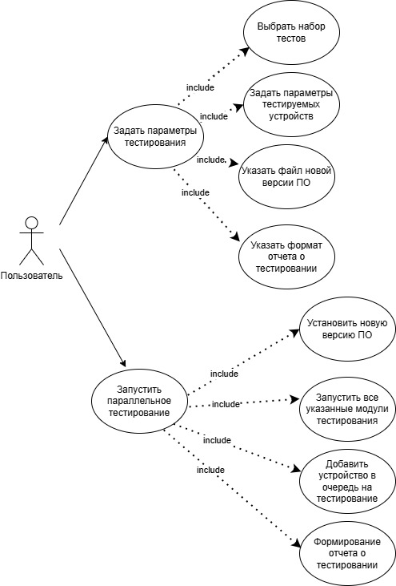

# Лабораторная работа 1.
# Задание
Тема: Формулирование требований к программной системе

Цель работы: Научиться анализировать поставленную задачу, формулировать функциональные и нефункциональные требования к проектируемой системе.

Ожидаемые результаты:

1.  Перечень заинтересованных лиц (стейкхолдеров) с краткими описаниями
    
2.  Перечень функциональных требований
    
3.  Диаграмма вариантов использования для функциональных требований
    
4.  Перечень сделанных предположений (всё, что не оговорено в постановке явно можно “додумать” самостоятельно)
    
Повышенная сложность:

1.  Перечень нефункциональных требований

# Решение
## Тема работы
Разработка системы автоматизированного тестирования ПО для телекоммуникационных устройств дорожной инфраструктуры
## Перечень стейкхолдеров
| № | Стейкхолдер | Краткое описание | Важно учесть |
|--|--|--|--|
|1|Разработчики прикладного ПО| Разработчикам необходимо провести Smoke-тестирование работоспособности новой версии ПО перед передачей ее на этап полного тестирования. Также разработчики используют результаты тестирования для отладки ПО| Разработчикам необходима возможность запуска Unit тестов и интеграционных тестов. Возможность получения подробных логов ошибки|
|2|Команда тестирования|Основную выгоду с автоматизации тестирования получает команда тестировщиков, так как это сокращает затрачиваемое время на поиск ошибок|Важно иметь полные логи тестирования, возможность легко расширить методику тестирования|
|3|Менеджмент компании|Менеджменту компании важно знать о стабильности создаваемого продукта, чтобы осознавать степень его готовности. Также стабильность продукта может использоваться в целях маркетинга и увеличения числа продаж|Менеджменту необходимо получать отчёты о тестировании, а также о проценте покрытия кода тестами

## Перечень функциональных требований
1. Между типами устройств набор тестов может отличаться. Решение должно автоматически выбирать тесты, которые относятся к типу тестируемого устройства
2. Должна быть возможность запустить отдельные тесты/группу тестов - точечное тестирование, без запуска остальной части тестирования
3. При запуске тестирования на устройство должна устанавливаться новая версия ПО, сброс предыдущей версии системы, для поддержания постоянства окружения тестирования
4. Возможность запускать тестирование на нескольких устройствах параллельно
5. Должна быть возможность поставить устройство на очередь тестирования (полезно в случае, если все устройства заняты)
6. Поддержка различных этапов тестирования: Unit-тестирования на C++, интеграционного тестирования на Python, E2E-тестов на JavaScript
7. Автоматическое формирование отчета о проведенном тестировании
8. Автоматическое формирование отчета о покрытии кода тестами в случае с Unit тестированием
## Перечень нефункциональных требований
1. Расширяемость системы под новые модули тестирования. Архитектура должна позволять добавить новые модули тестирования или изменить старые (например на другом языке или другой части ПО)
2. Отказоустойчивость. Система должна стабильно воспроизводить среду тестирования и запускать тестирование, влияние предыдущих действий по тестированию не должно влиять на текущие тесты.
3. Скорость. Установка новой версии ПО на устройства в очереди на тестирование должна проходить непрерывно (сразу после окончания загрузки на одно устройство в очереди, должна начинаться установка на следующее)
## Диаграмма вариантов использования

## Перечень сделанных предположений
1. Если необходимо узнать статус устройств на стенде тестирования, то необходим мониторинг статуса устройств с подробным описанием текущего состояния.
2. Если необходимо отменить тестирование, то должна произойти очистка очереди на тестирование
3. Для возможности изменять уровень логирования, необходима возможность конфигурировать логирование.