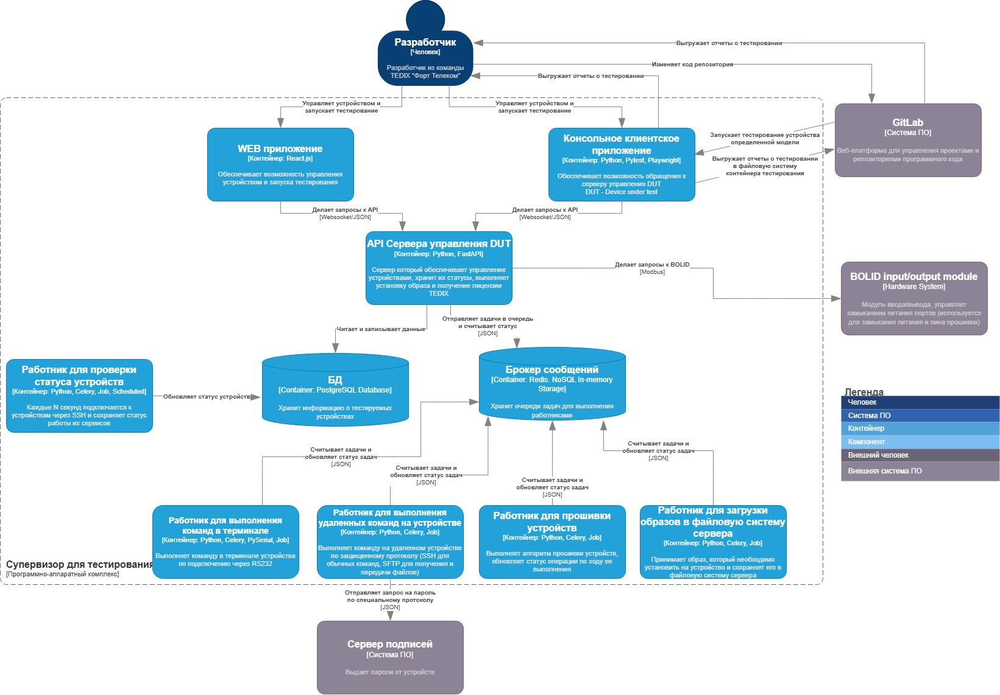

# Лабораторная работа 2

## Тема

Использование нотации C4 model для проектирования архитектуры программной системы

## Цель работы

Получить опыт использования графической нотации для фиксации архитектурных решений.

## Диаграмма системного контекста

Супервизором для тестирования в основном будут пользоваться разработчики для воспроизведения тестирования (интеграционного, E2E) на устройствах компании. 

Они могут использовать его как вручную, так и через GitLab (где запускается скрипт для старта работы супервизора).

Пользователю возвращается отчет о тестировании, который сохраняется в файловую систему из которой он запускался

Сервер подписей - система ПО для получения секретных паролей от устройств, проверяет подлинность запросов, работает по специальному протоколу, который не подлежит разглашению

## Диаграмма контейнеров
Подобная архитектура была выбрана по причине того, что многие команды (например SSH-запросы, прошивка устройства, загрузка образа и т.д.)
могут занимать неопределенное количество времени, которое превышает время соединения по HTTP
Более того, при обычном подходе с вариантом запрос-ответ, пользователь вынужден ждать от 10 секунд до нескольких минут без какого-либо ответа,
возможно бэкэнд уже и не работает, а пользователь не будет иметь возможности узнать статус его задачи.

По этой причине было выбрано решение с брокером сообщений и работникам в других процессах, которые:
1. Не блокируют работу API во время выполнения длительных запросов
2. Позволяют дать пользователю моментальный ответ о том, что запрос принят в обработку
3. Позволяют пользователю мониторить статус выполняемых задач

P.S. *Первым вариантом решения данной проблемы была технология WebSocket,
которая в целом решала проблемы с передачей статусов и логов
в режиме реального времени, но
асинхронный код с множеством различных задач выполняющихся в одном потоке трудно поддерживать,
поэтому решение было изменено в пользу брокеров сообщений и работников в других процессах.*

Супервизор тестирования состоит из нескольких частей:

1. Консольное клиентское приложение: обеспечивает удобный запуск тестирования через командную строку с возможностью указания параметров.  
Реализует в себе алгоритмы для выбора устройств на тестирование и  
инициализацию тест-раннера в зависимости от типа тестирования и языка тестирования

1. WEB-приложение: реализует чуть урезанный по сравнению с консольным приложением функционал, но обеспечивает более интуитивную работу с комплексом тестирования

1. API сервера управления DUT: управляет статусами DUT, их питанием, обрабатывает запросы к устройствам, необходимые при работе с ними и перенаправляет часть задач в очередь задач Redis.

1. Брокер сообщений хранит в себе очереди задач, полученные от API, а также статусы их выполнения.

1. БД хранит данные о статусах питания устройств, их моделях, установленных образах, статусах тестирования

1. Работник для проверки статуса устройств периодически проверяет работу устройств по SSH, сохраняет статус работы устройства в БД.

1. Работник для выполнения команд в терминале выполняет требуемые команды по RS232 (Serial) и сохраняет результаты в статус задачи.

1. Работник для выполнения удаленных команд на устройстве выполняет SSH, SFTP (для файлов) запросы на устройстве с сохранением результата в статус задачи.

1. Работник для прошивки устройств реализует алгоритм, по которому устройство прошивается, сохраняет прогресс и логи прошивки устройства в статус задачи.

1. Работник для загрузки образов принимает файл с образом и сохраняет его в файловую систему, а также обеспечивает к ним доступ по названию.

## Диаграмма компонентов

У API есть главный маршрутизатор Application Router,  
который распределяет запросы по нужным частям приложения.

Далее каждый маршрутизатор обращается к своему сервису и выполняет свои задачи.

Часть сервисов (которая обращается к брокеру сообщений) создает задачу для Celery работника и отправляет JSON в очередь в No-SQL хранилище Redis

Сервис по управлению портами устройства обращается к BOLID (модель модуля ввода/вывода) по протоколу Modbus для чтения и записи информации (замыкания портов),
после этого обращается к БД и записывает полученные изменения

Сервис для обработки данных устройств просто обращается к БД для выполнения полученных запросов.