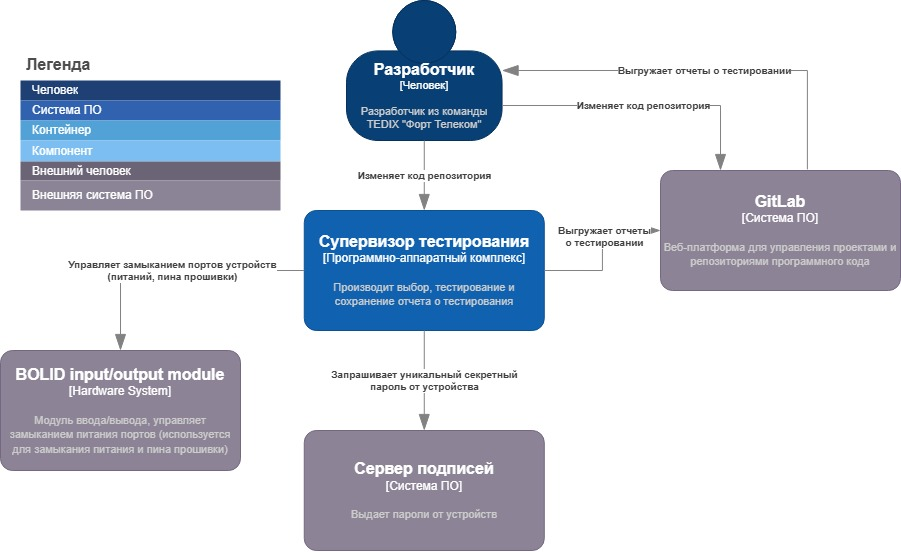

# Лабораторная работа 2

## Тема

Использование нотации C4 model для проектирования архитектуры программной системы

## Цель работы

Получить опыт использования графической нотации для фиксации архитектурных решений.

## Диаграмма системного контекста

Супервизором для тестирования в основном будут пользоваться разработчики для воспроизведения тестирования (интеграционного, E2E) на устройствах компании. 

Они могут использовать его как вручную, так и через GitLab (где запускается скрипт для старта работы супервизора).

Пользователю возвращается отчет о тестировании, который сохраняется в файловую систему из которой он запускался

## Диаграмма контейнеров

Супервизор тестирования состоит из нескольких частей:

1. Клиент для тестирования: обеспечивает удобный запуск тестирования через командную строку с возможностью указания параметров, реализует в себе алгоритмы для выбора устройств на тестирование и инициализации тест-раннера в зависимости от типа тестирования и языка тестирования

2. Сервер управления DUT: управляет статусами DUT, их питанием, обрабатывает запросы к устройствам, необходимые при работе с ними

3. Сервер для загрузки образов устройства: получает от клиента образ, который необходимо будет установить на устройство для тестирования

4. БД хранит данные о статусах питания устройств, их моделях, установленных образах, статусах тестирования

## Диаграмма компонентов

(например, Unit-C++ тесты, Integration-Python (фреймворк: pytest) или E2E-Node.js (фреймворк: playwright))

<Представить диаграмму / диаграммы компонентов. Дать краткое описание основных элементов диаграммы / диаграмм.> 
