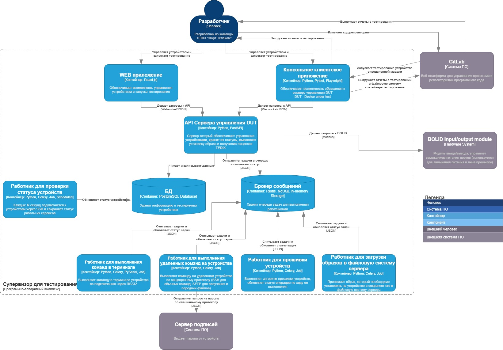
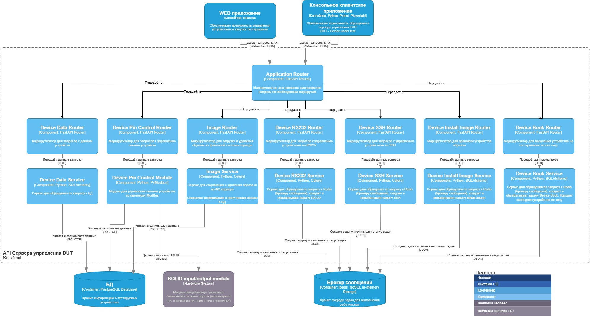
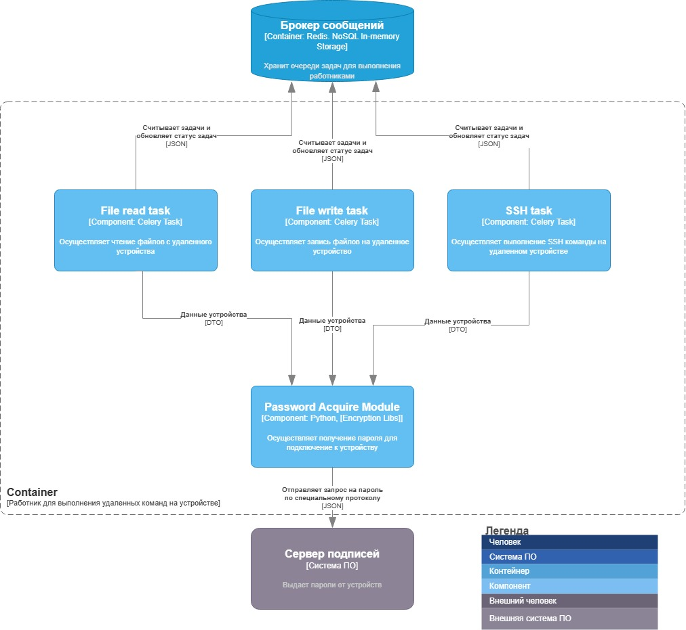
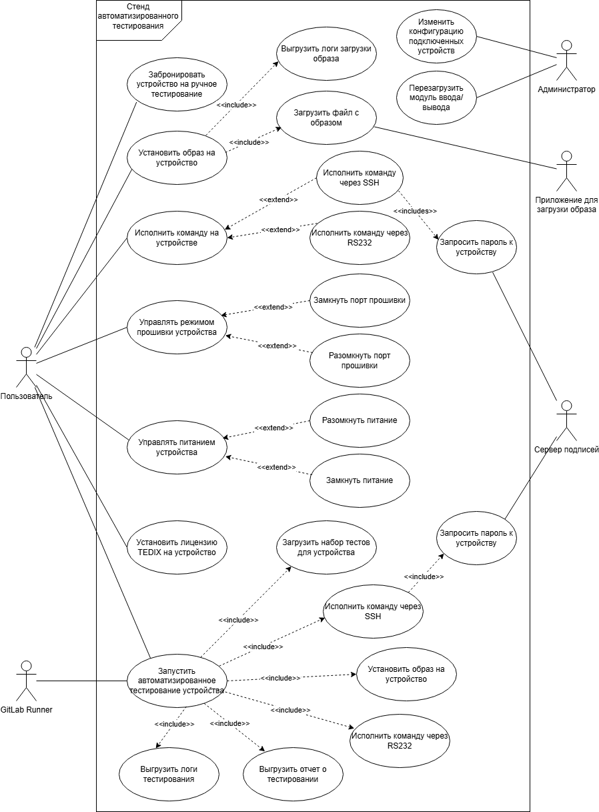
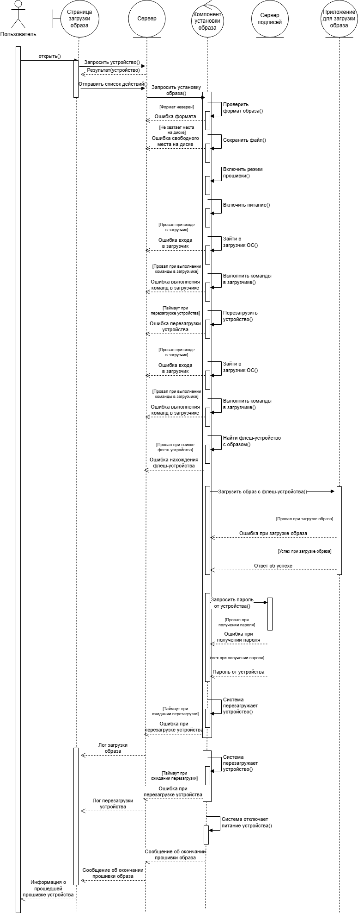
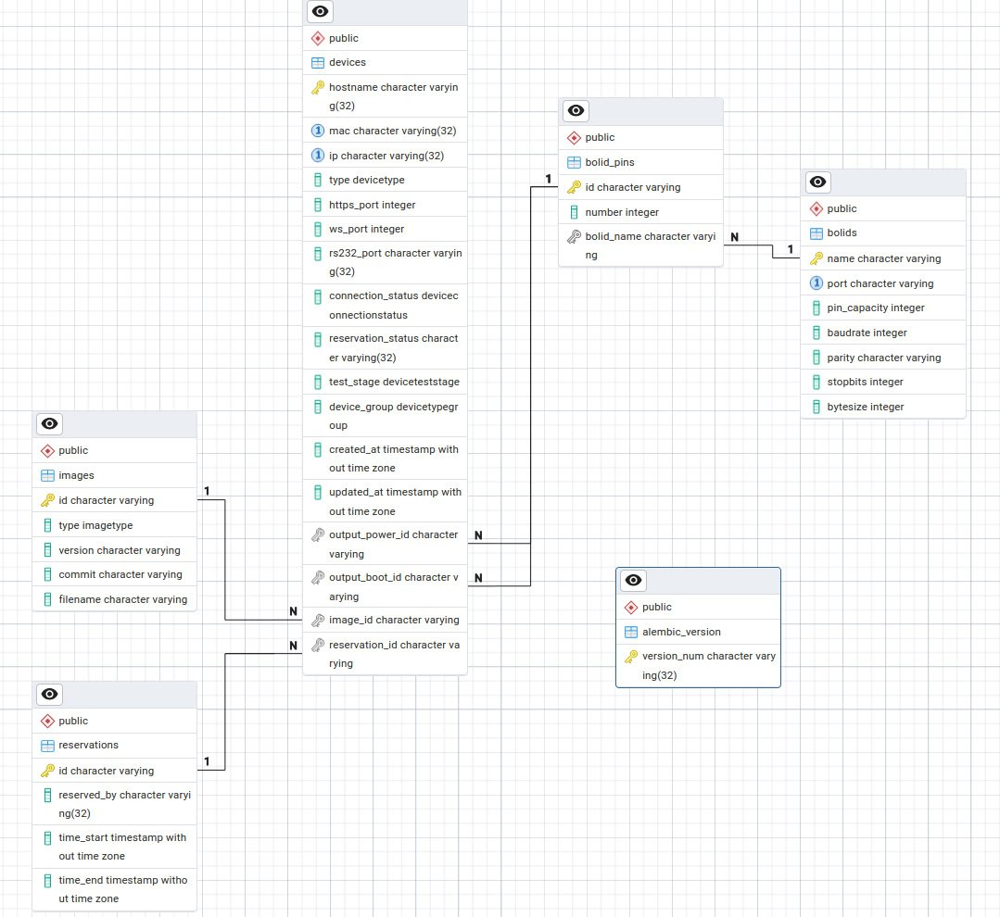

# Ожидаемые результаты:
- Для выбранного варианта использования:
Добавить ранее созданные или создать диаграммы контейнеров и компонентов нотации C4 model. 
(1 балл) 
- Построить диаграмму последовательностей для выбранного варианта использования (показать взаимодействие C4-компонентов для реализации выбранного варианта использования). 
(2 балла)
- Построить модель БД в виде диаграммы классов UML. Если по заданию не предусмотрена БД, то самостоятельно продумать возможное хранилище данных, связанное с заданием. Минимально количество сущностей: 5. 
(1 балл)
- Реализовать требуемый клиентский и серверный код с учетом принципов KISS, YAGNI, DRY и SOLID. Пояснить, каким образом были учтены эти принципы. 
(4  балла)


# 1. Диаграммы компонентов и контейнеров
## Диаграмма контейнеров

## Диаграмма компонентов 1

## Диаграмма компонентов 2


# 2. Диаграмма последовательностей
## Варианты использования


## Диаграмма последовательностей


# 3. Модель БД.
База данных включает в себя 6 таблиц:
1 таблица для миграций (версионирование)

5 связанных таблиц, связанных с предметной областью
1. Устройство
2. Образ устройства
3. Порт питания устройства
4. Порт прошивки устройства
5. Модуль ввода/вывода (хранит в себе порты питания и прошивки устройства)



# 4. Принципы KISS, DRY, YAGNI, SOLID
## KISS
KISS - Keep it simple, stupid. 
- Код должен быть простым и понятным
- Используются стандартные библиотеки и подходы

В случае с моим приложением:
1. Проект декомпозирован на простые элементы, в которых выполняются базовые действия, запросы к бд (можно посмотреть на структуру проекта в src/fastapi_celery)
2. Использован FastAPI (одна из популярнейших библиотек) со стандартным REST API.
3. Все сущности упрощены и разбиты на атомарные элементы

## DRY
DRY - Don't Repeat Yourself

В данном случае подразумевается, что идентичные действия, которые многократно выполняются в разных частях программы можно преобразовать в методы и вызывать их.

Это позволяет при изменении логики работы общего функционала, поменять код в 1 месте, а не искать разбросанные куски по всему приложению.  
Также сокращает время на расширение функционала.

Как пример можно привести следующий метод из модуля с бронированием устройств на тестирование ([convert_schemas](../src/src/fastapi_celery/device_reserve/convert_model_schema.py)):  
В данном случае необходимо было конвертировать модель из БД в Data Transfer Object по определенным правилам и для того, чтобы не писать данный функционал в каждом методе сервиса он был вынесен в общий метод.

Код метода:
```python
def convert_from_model_to_schema(model: Reservation) -> ReservationSchema:
    schema = ReservationSchema(
        id=model.id,
        reserved_by=model.reserved_by,
        time_start=model.time_start,
        time_end=model.time_end
    )

    return schema
```

Его использование в коде:
```python
def get_reservation_by_device(db: Session, hostname: str) -> ReservationSchema:
    try:
        reservation_db: Reservation = db.query(Reservation).join(Device, Device.reservation_id == Reservation.id).filter(
            Device.hostname == hostname
        ).one()
    except NoResultFound as exc:
        raise ReservationNotFoundError(
            f"Reservation was not found by hostname '{hostname}'. Either no device with hostname or no attached reservation to this device.")

    reservation_schema = convert_from_model_to_schema(reservation_db)

    return reservation_schema
```

```python
def get_reservation_by_id(db: Session, reservation_id: str) -> ReservationSchema:
    reservation_db: Reservation = db.query(Reservation).filter(
        Reservation.id == reservation_id).first()

    if reservation_db is None:
        raise ReservationNotFoundError(
            f"Reservation with ID {reservation_id} not found")

    reservation_schema = convert_from_model_to_schema(reservation_db)

    return reservation_schema
```

## YAGNI
YAGNI - You aren't gonna need it

Данный принцип подразумевает написание только необходимого функционала, любое расширение кода происходит только при возникающей потребности.

В данном случае трудно указать это в одном месте кода, так как это просматривается во всем приложении.

В данном случае все написанные методы используются и были изначально заложены при проектировании системы. Отсутствуют методы, которые нигде не вызываются.

## SOLID
SOLID включает в себя 5 принципов:
### S - Single Responsibility.
Принцип единственной ответственности, что любой метод, сущность должны выполнять только одну функцию.

В данном случае опять же можно посмотреть на структуру проекта, каждая сущность вынесена в отдельный модуль, который включается части, необходимые для сущности (сервис, маршрутизатор, подключение к БД (если необходимо))

Пример использования можно наблюдать в модуле бронирования устройств ([reservation_logic](../src/src/fastapi_celery/device_reserve/reservation_logic.py)). В данном случае функционал связанный с алгоритмом выбора устройства для резервирования был вынесен отдельно от методов связанных с операциями с БД. При этом в данном модуле операции разбиты на методы, хотя всё это и является частью одной большой операции.

Пройдемся по коду:

Метод ```count_devices_by_types()``` считает количество устройств по типам, данный функционал используется далее. Метод имеет одну задачу - посчитать количество устройств по каждому типу и вернуть словарь со значениями.

Можно было бы сделать это и в дальнейших методах, но тогда это бы нарушило принцип единственной ответственности 
```python
def count_devices_by_types(devices: List[Device]) -> Dict[DeviceType, int]:
    device_type_count: Dict[DeviceType, int] = defaultdict(int)

    for device in devices:
        device_type_count[device.type] += 1

    return device_type_count
```

Метод ```is_enough_devices()``` проверяет достаточно ли устройств для бронирования. Проверяет количество запрошенных устройств и доступных. 
Использует предыдущий метод, при этом выполняет только одну функцию - проверить достаточно ли устройств.

```python
def is_enough_devices(devices: List[Device], requested_types: Dict[DeviceType, int]) -> bool:
    current_types_count = count_devices_by_types(devices)

    for requested_type, amount in requested_types.items():
        if requested_type not in current_types_count or current_types_count[requested_type] < amount:
            return False

    return True
```

Метод ```select_devices_to_reserve()``` выбирает устройства на бронирование. Использует метод ```is_enough_devices()``` упомянутый ранее для того, чтобы проверить валидность операции, при этом выполняет только одну функцию - выбрать конкретные устройства на бронирование. 

```python
def select_devices_to_reserve(available_devices: List[Device], requested_types: Dict[DeviceType, int]) -> List[Device]:
    if not is_enough_devices(available_devices, requested_types):
        raise NotEnoughAvailableDevicesError(
            "Not enough available devices to select from")

    device_types_to_select = requested_types.copy()

    selected_devices: List[Device] = []

    for device in available_devices:
        if device.type in requested_types and device_types_to_select[device.type] > 0:
            selected_devices.append(device)
            device_types_to_select[device.type] -= 1

    return selected_devices
```

### O - Open/Closed Principle

Код открыт для расширения, но закрыт для изменения. Подразумевает, что существующие сущности не будут изменяться, а будут только расширяться (например, при помощи наследования)

В данном случае трудно найти в пример в логической части кода, но тем не менее подобный принцип был применен при создании исключений.

Для каждого модуля были созданы базовые классы исключений, далее при расширении кода и появлении новых исключений, которые необходимо обработать, они наследуются от базовых исключений со своими параметрами. Таким образом поддерживается принцип открытости/закрытости.

Пример кода ([exceptions.py](../src/src/fastapi_celery/exceptions.py)):
```python
class DeviceDataExceptionBase(BaseException):
    """
    Base class for exceptions in Device Data module
    """
    pass


class DeviceNotFoundError(DeviceDataExceptionBase):
    """Raised when device is not found in database"""

    def __init__(self, message: str):
        super().__init__(message, status_code=404)


class DeviceHasNoImageError(DeviceDataExceptionBase):
    """Raised when device db model does not have related image"""

    def __init__(self, message: str):
        super().__init__(message, status_code=404)
```


### L - Liskov Substitute Principle

Принцип подстановки Барбары Лисков - следование принципу LSP заключается в том, что при построении иерархий наследования создаваемые наследники должны корректно реализовывать поведение базового типа. То есть если базовый тип реализует определённое поведение, то это поведение должно быть корректно реализовано и для всех его наследников.

В данном случае невозможно показать принцип Барбары Лисков в действии, так как в реализованном проекте не было подобного наследования с использованием методов.


### I - Interface Segregation
Принцип разделения интерфейса (Interface Segregation). Большой интерфейс должен быть разбит на несколько меньших и более конкретных, чтобы клиенты могли использовать только те интерфейсы, которые им нужны.

В данном случае интерфейсы не применялись в виду архитектурного решения при создании проекта. Проект разбит на модули, которые хранят в себе только методы, которые относятся к данному модулю.

В качестве примера, можно привести код из предыдущей версии проекта:

При работе с устройством клиенту необходимо делать множество различных действий, поэтому они были разбиты на более мелкие интерфейсы

Класс отвечает за бронирование устройства
```python
class DeviceBookServiceBase(RequestServiceBase):
    @abstractmethod
    async def book_no_wait(self, hostname: str, user: StandUser) -> Device:
        """
        Book devices avoiding requests list.
        Instantly sets status BUSY to devices because they are already returned to request source.
        """
        raise NotImplementedError()

    @abstractmethod
    async def unbook_no_wait(self, hostname: str) -> Device:
        """
        Unbook devices avoiding requests list.
        Instantly sets status AVAILABLE to device.
        """
        raise NotImplementedError()
```

Класс отвечает за обработку запросов к устройству
```python
class RequestServiceBase(ABC):
    @abstractmethod
    async def enqueue(self, request: Request) -> Request:
        """Enqueue request"""
        raise NotImplementedError()

    @abstractmethod
    async def get_status(self, request_id: str) -> Request:
        """Gets status of request in queue"""
        raise NotImplementedError()

    @abstractmethod
    async def cancel_request(self, request_id: str) -> Request:
        """Cancels execution of requested action if it has been started"""
        raise NotImplementedError()

```
и т.д.


### D - Dependency Inversion
Принцип инверсии зависимостей (Dependency Inversion). Зависимости внутри системы должны строиться на основе абстракций, а не деталей.

В данном случае отличным примером является обращение к базе данных.

FastAPI предоставляет механизм ```Depends()```, который помогает в реализации инверсии зависимостей. Мы обращаемся к методу ```get_db()``` при помощи механизма ```Depends()``` и тем самым обращаемся не к деталям сущности базы данных, а к методу, который получает к ней доступ (при этом деталей мы не знаем).

Пример кода:
```python
from fastapi import Depends
from ..database import get_db

@router.get('', response_model=List[DeviceSchema])
async def device_list(
    types: List[DeviceType] = Query(
        None, description="List of device types to filter by"),
    connection_status: Optional[DeviceConnectionStatus] = Query(
        None, description="Filter by connection status"),
    test_stage: Optional[DeviceTestStage] = Query(
        None, description="Filter by test stage"),
    type_group: Optional[DeviceTypeGroup] = Query(
        None, description="Filter by type group"),

        db: Session = Depends(get_db)):

    devices: List[DeviceSchema] = service.get_devices(
        db,
        device_types=types,
        connection_status=connection_status,
        test_stage=test_stage,
        type_group=type_group
    )

    return devices
```