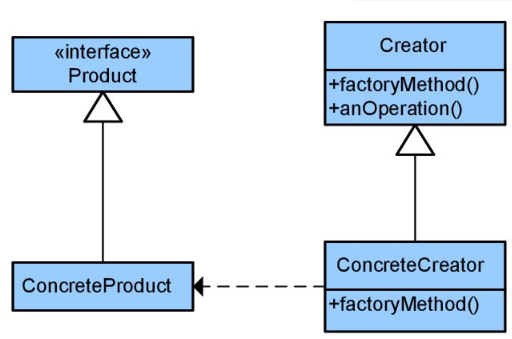

# Лабораторная работа №6
## Тема: Использование шаблонов проектирования
## Цель работы: Получить опыт применения шаблонов проектирования при написании кода программной системы.

## Ожидаемые результаты:
- Применить типовые шаблоны проектирования GoF (Gang of Four) для своего проекта. Продемонстрировать результаты в виде конечного кода и UML-диаграмм.
Порождающие шаблоны - 3 шт.
Структурные шаблоны - 4 шт.
Поведенческие шаблоны - 5 шт.
(8 баллов)
Возможна замена одного шаблона из другой группы шаблонов. 

- Повышенная сложность:
Проанализировать созданный код на наличие реализованных шаблонов GRASP. По необходимости реализовать:
5 ролей (обязанностей) классов
3 принципа разработки
1 свойство программы
	(2 балла)

# Порождающие шаблоны
## 1. Singleton

Гарантирует, что класс имеет только один экземпляр и предоставляет глобальную точку доступа к нему. Используется, когда необходимо контролировать создание экземпляра класса и обеспечить доступ к нему из любой части программы.

Можно использовать для доступа к базе данных, локального хранилища или логгера.

```python
 import logging

    class Logger:
        _instance = None

        def __new__(cls, *args, **kwargs):
            if cls._instance is None:
                cls._instance = super().__new__(cls)
                cls._instance._logger = logging.getLogger("app_logger")
                cls._instance._logger.setLevel(logging.DEBUG)
                formatter = logging.Formatter('%(asctime)s - %(levelname)s - %(message)s')
                ch = logging.StreamHandler()
                ch.setFormatter(formatter)
                cls._instance._logger.addHandler(ch)
            return cls._instance

        def debug(self, message):
            self._logger.debug(message)

        def info(self, message):
            self._logger.info(message)

        def warning(self, message):
            self._logger.warning(message)

        def error(self, message):
            self._logger.error(message)

        def critical(self, message):
            self._logger.critical(message)

    # Пример использования
    logger1 = Logger()
    logger1.info("Приложение запущено")
    logger1.debug("Отладочное сообщение")

    logger2 = Logger()
    logger2.error("Произошла ошибка")

    print(logger1 is logger2)  # Вывод: True
```


## 2. Фабричный метод (Fabric)
Описание:
Определяет интерфейс для создания объекта, но оставляет подклассам решение о том, какой класс инстанцировать.
Позволяет классу делегировать инстанцирование подклассам.

- Product (Продукт): Интерфейс или абстрактный класс, определяющий тип создаваемых объектов.
- ConcreteProduct (Конкретный Продукт): Классы, реализующие интерфейс Product.
- Creator (Создатель): Интерфейс или абстрактный класс, объявляющий фабричный метод.
- ConcreteCreator (Конкретный Создатель): Классы, реализующие фабричный метод и возвращающие экземпляры 


В данном случае мы делегируем удаленный доступ к устройству разным видам клиентов (SSH, Telnet, Serial)

```python
    from abc import ABC, abstractmethod

    # Product
    class RemoteClient(ABC):
        @abstractmethod
        def connect(self, host, user, password):
            pass

        @abstractmethod
        def execute_command(self, command):
            pass

        @abstractmethod
        def disconnect(self):
            pass

    # Concrete Products
    class SSHClient(RemoteClient):
        def connect(self, host, user, password):
            print(f"Connecting to {host} via SSH")

        def execute_command(self, command):
            print(f"Executing SSH command: {command}")

        def disconnect(self):
            print("Disconnecting SSH")

    class TelnetClient(RemoteClient):
        def connect(self, host, user, password):
            print(f"Connecting to {host} via Telnet")

        def execute_command(self, command):
            print(f"Executing Telnet command: {command}")

        def disconnect(self):
            print("Disconnecting Telnet")

    class SerialClient(RemoteClient):
        def connect(self, host, user, password):
            print(f"Connecting to {host} via Serial")

        def execute_command(self, command):
            print(f"Executing Serial command: {command}")

        def disconnect(self):
            print("Disconnecting Serial")

    # Creator
    class RemoteClientFactory(ABC):
        @abstractmethod
        def create_client(self):
            pass

    # Concrete Creators
    class SSHClientFactory(RemoteClientFactory):
        def create_client(self):
            return SSHClient()

    class TelnetClientFactory(RemoteClientFactory):
        def create_client(self):
            return TelnetClient()

    class SerialClientFactory(RemoteClientFactory):
        def create_client(self):
            return SerialClient()

    def test_device(factory, host, user, password, command):
        client = factory.create_client()
        client.connect(host, user, password)
        client.execute_command(command)
        client.disconnect()

    ssh_factory = SSHClientFactory()
    test_device(ssh_factory, "192.168.1.100", "testuser", "password", "uname -a")

    telnet_factory = TelnetClientFactory()
    test_device(telnet_factory, "192.168.1.101", "testuser", "password", "ls -l")

    serial_factory = SerialClientFactory()
    test_device(serial_factory, "/dev/ttyUSB0", "testuser", "password", "version")
```


## 3. Строитель (Builder)
- Product (Продукт): Объект, который нужно построить.
- Builder (Строитель): Интерфейс или абстрактный класс, определяющий шаги для построения объекта.
- ConcreteBuilder (Конкретный Строитель): Классы, реализующие интерфейс Builder и предоставляющие конкретные реализации шагов.
```python
   class TestConfiguration:
        def __init__(self):
            self.device_type = None
            self.remote_protocol = None
            self.test_commands = []
            self.log_level = "INFO"

        def __str__(self):
            return f"Device Type: {self.device_type}, Remote Protocol: {self.remote_protocol}, Test Commands: {self.test_commands}, Log Level: {self.log_level}"

    class TestConfigurationBuilder:
        def __init__(self):
            self.config = TestConfiguration()

        def set_device_type(self, device_type):
            self.config.device_type = device_type
            return self

        def set_remote_protocol(self, protocol):
            self.config.remote_protocol = protocol
            return self

        def add_test_command(self, command):
            self.config.test_commands.append(command)
            return self

        def set_log_level(self, level):
            self.config.log_level = level
            return self

        def build(self):
            return self.config

    # Пример использования
    builder = TestConfigurationBuilder()
    config = (
        builder.set_device_type("Router")
        .set_remote_protocol("SSH")
        .add_test_command("uname -a")
        .add_test_command("ifconfig")
        .set_log_level("DEBUG")
        .build()
    )

    print(config)
```


# Структурные шаблоны

## 1. Декоратор

Позволяет дополнить функциональность конкретного объекта, не меняя поведение всего класса.


```python
@router.get('/{device_hostname}', response_model=DeviceSchema)
async def get_device_single(hostname: str, db: Session = Depends(get_db)):
    try:
        device: DeviceSchema = service.get_device(db, hostname)
    except DeviceNotFoundError as exc:
        raise HTTPException(status_code=exc.status_code, detail=str(exc))

    return device
```


## 2. Адаптер

- Target (Цель): Интерфейс, который ожидает клиентский код.
- Adaptee (Адаптируемый): Класс с несовместимым интерфейсом, который нужно адаптировать.
- Adapter (Адаптер): Класс, который реализует интерфейс Target и преобразует вызовы к Adaptee.


Используется, когда существующий класс не подходит под интерфейс системы.
Например, если используется сторонняя библиотека

Пример запуска ssh-команды

```python
    # Целевой интерфейс (стандартизированный)
    class DeviceConnection:
        def execute_command(self, command):
            pass

    # Адаптируемый класс (нестандартный SSH-клиент)
    class CustomSSHClient:
        def run_command(self, host, user, cmd):
            process = subprocess.Popen(
                ["custom_ssh", "-h", host, "-u", user, cmd],
                stdout=subprocess.PIPE,
                stderr=subprocess.PIPE,
            )
            stdout, stderr = process.communicate()
            return stdout.decode()

    # Адаптер
    class SSHAdapter(DeviceConnection):
        def __init__(self, ssh_client, host, user):
            self._ssh_client = ssh_client
            self._host = host
            self._user = user

        def execute_command(self, command):
            return self._ssh_client.run_command(self._host, self._user, command)

    # Клиентский код (система тестирования)
    class DeviceTester:
        def test_device(self, device_connection, test_command):
            result = device_connection.execute_command(test_command)
            print(f"Test result: {result}")

    # Пример использования
    custom_ssh = CustomSSHClient()
    ssh_adapter = SSHAdapter(custom_ssh, "192.168.1.100", "testuser")
    device_tester = DeviceTester()

    device_tester.test_device(ssh_adapter, "uname -a")
```


## 3. Мост

- Abstraction (Абстракция): Определяет интерфейс для клиентского кода.
- Implementor (Реализатор): Определяет интерфейс для реализации.
- ConcreteImplementor (Конкретный Реализатор): Реализует интерфейс Implementor.

Позволяет разделить привязку между абстракцией и реализацией.

```python
    import subprocess

    # Реализатор (интерфейс SSH-соединения)
    class SSHImplementor:
        def execute_ssh_command(self, host, user, command):
            pass

    # Конкретный реализатор (реализация SSH через subprocess)
    class SubprocessSSH(SSHImplementor):
        def execute_ssh_command(self, host, user, command):
            process = subprocess.Popen(
                ["ssh", f"{user}@{host}", command],
                stdout=subprocess.PIPE,
                stderr=subprocess.PIPE,
            )
            stdout, stderr = process.communicate()
            return stdout.decode()

    # Конкретный реализатор (реализация SSH через paramiko)
    class ParamikoSSH(SSHImplementor):
        def execute_ssh_command(self, host, user, command):
            import paramiko

            ssh = paramiko.SSHClient()
            ssh.set_missing_host_key_policy(paramiko.AutoAddPolicy())
            ssh.connect(hostname=host, username=user)
            stdin, stdout, stderr = ssh.exec_command(command)
            output = stdout.read().decode()
            ssh.close()
            return output

    # Абстракция (управление устройством)
    class DeviceManager:
        def __init__(self, ssh_implementor):
            self._ssh_implementor = ssh_implementor

        def execute_command(self, host, user, command):
            return self._ssh_implementor.execute_ssh_command(host, user, command)

    device_manager_subprocess = DeviceManager(SubprocessSSH())
    result_subprocess = device_manager_subprocess.execute_command(
        "192.168.1.100", "testuser", "uname -a"
    )
    print(f"Subprocess SSH result: {result_subprocess}")

    device_manager_paramiko = DeviceManager(ParamikoSSH())
    result_paramiko = device_manager_paramiko.execute_command(
        "192.168.1.100", "testuser", "uname -a"
    )
    print(f"Paramiko SSH result: {result_paramiko}")
```


## 4. Прокси

- Subject (Субъект): Определяет общий интерфейс для прокси и реального объекта.
- RealSubject (Реальный Субъект): Реализует интерфейс Subject и выполняет реальную работу.
- Proxy (Прокси): Реализует интерфейс Subject и контролирует доступ к 

Предоставляет возможность доступа к объекту, при помощи другого способа. При этом имеет одинаковые интерфейсы.

```python
    import subprocess

    # Субъект (интерфейс доступа к устройству)
    class DeviceAccess:
        def execute_command(self, command):
            pass

    # Реальный субъект (доступ к устройству по SSH)
    class RealDeviceAccess(DeviceAccess):
        def __init__(self, host, user):
            self._host = host
            self._user = user

        def execute_command(self, command):
            process = subprocess.Popen(
                ["ssh", f"{self._user}@{self._host}", command],
                stdout=subprocess.PIPE,
                stderr=subprocess.PIPE,
            )
            stdout, stderr = process.communicate()
            return stdout.decode()

    # Прокси (доступ через Raspberry Pi)
    class RaspberryPiProxy(DeviceAccess):
        def __init__(self, device_host, device_user, proxy_host, proxy_user):
            self._device_host = device_host
            self._device_user = device_user
            self._proxy_host = proxy_host
            self._proxy_user = proxy_user

        def execute_command(self, command):
            # SSH на Raspberry Pi, затем SSH с Raspberry Pi на устройство
            proxy_command = f'ssh {self._device_user}@{self._device_host} "{command}"'
            process = subprocess.Popen(
                ["ssh", f"{self._proxy_user}@{self._proxy_host}", proxy_command],
                stdout=subprocess.PIPE,
                stderr=subprocess.PIPE,
            )
            stdout, stderr = process.communicate()
            return stdout.decode()

    # Клиентский код
    real_device_access = RealDeviceAccess("192.168.1.100", "deviceuser")
    proxy_access = RaspberryPiProxy(
        "192.168.1.100", "deviceuser", "192.168.1.101", "pi"
    )

    # Доступ к устройству напрямую
    real_result = real_device_access.execute_command("uname -a")
    print(f"Direct access result: {real_result}")

    # Доступ к устройству через прокси
    proxy_result = proxy_access.execute_command("uname -a")
    print(f"Proxy access result: {proxy_result}")
```


# Поведенческие шаблоны
## 1. Хранитель (Memento)

- Originator (Создатель): Объект, состояние которого нужно сохранять. Он создает и восстанавливает «снимки» своего состояния.

- Memento (Снимок): Объект, хранящий состояние Originator. Он не должен быть доступен извне, чтобы не нарушать инкапсуляцию.

- Caretaker (Хранитель): Объект, который хранит Memento. Он не имеет доступа к внутреннему состоянию Memento и не может его изменять.

Под капотом Alembic.


## 2. Наблюдатель (Observer)

- Subject (Субъект): Объект, за состоянием которого наблюдают. Он хранит список наблюдателей и уведомляет их об изменениях.

- Observer (Наблюдатель): Объект, который хочет быть уведомленным об изменениях состояния субъекта. Он реализует интерфейс, позволяющий субъекту уведомлять его.


Используется при создании задач и ожидании их из очереди. В данном случае задач передается на работу в device_ssh модуль.

```python
def ssh_command(cmd: str, hostname: str, username: SshUser, db: Session = Depends(get_db)) -> SshQueuedResponse:
    try:
        device: DeviceSchema = get_device(db=db, hostname=hostname)

        if device.image_id is None:
            raise DeviceHasNoImageError(
                "You must upload image for device before using ssh command.")

        image: ImageSchema = get_image(db, device.image_id)

        task = task_ssh.delay(
            command=cmd,
            hostname=device.ip,
            username=username,
            device_type=device.type,
            image_type=image.type
        )

        response = SshQueuedResponse(id=task.id, location=f"/queue/{task.id}")
        return response
    except DeviceHasNoImageError as exc:
        raise HTTPException(status_code=exc.status_code, detail=str(exc))
    except DeviceNotFoundError as exc:
        raise HTTPException(status_code=exc.status_code, detail=str(exc))
    except ImageNotFoundInDatabaseError as exc:
        raise HTTPException(status_code=exc.status_code, detail=str(exc))
```


## 3. Chain of responsibility

- Handler (Обработчик): Определяет интерфейс для обработки запросов. Может содержать ссылку на следующий обработчик в цепочке.
- ConcreteHandler (Конкретный обработчик): Реализует обработку запроса. Если может обработать запрос, то делает это; иначе передает запрос следующему обработчику.
- Client (Клиент): Инициирует запрос, отправляя его первому обработчику в цепочке.


Пример работы: уровни ответственности. В данном случае, пароль от образа могут выдавать на разных уровнях (пароль от релизного образа более защищен, чем dev образ)

```python
from abc import ABC, abstractmethod

# Интерфейс обработчика
class Approver(ABC):
    def __init__(self, successor=None):
        self._successor = successor

    @abstractmethod
    def get_password(self, request):
        pass

# Конкретные обработчики
class SshPasswordNoneLevel(Approver):
    def get_password(self, request):
        if request.image_type.value <= ImageType.None.value:
            return some_password
        elif self._successor:
            self._successor.get_password(request)
        else:
            raise Exception("Could not get password")

class SshPasswordDevLevel(Approver):
    def get_password(self, request):
        if ImageType.NONE.value <= request.image_type.value <= ImageType.DEV.value:
            return some_password
        elif self._successor:
            self._successor.get_password(request)
        else:
            raise Exception("Could not get password")

class SshPasswordProdLevel(Approver):
    def get_password(self, request):
       return some_password

class SshRequest:
    def __init__(self, command, image_type):
        self.command = command
        self.image_type = image_type

ssh_password_none_level = SshPasswordNoneLevel()
ssh_password_dev_level = SshPasswordDevLevel(ssh_password_none_level)
ssh_password_prod_level = SshPasswordProdLevel(ssh_password_dev_level)

request = SshRequest("command", ImageType.DEV)

ssh_password_prod_level.get_password(request)
```


## 4. State
- Context (Контекст): Объект, который имеет внутреннее состояние и изменяет своё поведение в зависимости от него. Он хранит ссылку на текущее состояние.
- State (Состояние): Интерфейс или абстрактный класс, определяющий методы, которые должны быть реализованы в каждом конкретном состоянии.
- ConcreteState (Конкретное состояние): Классы, реализующие конкретные состояния. Каждый класс определяет поведение объекта в данном состоянии.


В данном случае установщик может обрабатывать только один запрос одновременно. Поэтому при поступлении новых запросов, пока он заблокирован необходимо сделать иные действия.

```python
    from abc import ABC, abstractmethod

    # Интерфейс состояния
    class InstallerState(ABC):
        @abstractmethod
        def process_request(self, installer):
            pass

    # Конкретное состояние: доступно
    class AvailableState(InstallerState):
        def process_request(self, installer):
            print("Host is available. Processing request.")
            installer.set_state(BusyState())  # Переход в состояние "занято"

    # Конкретное состояние: занято
    class BusyState(InstallerState):
        def process_request(self, installer):
            print("Host is busy. Request queued.")

    # Контекст: Host устройство
    class InstallerDevice:
        def __init__(self):
            self._state = AvailableState()  # Начальное состояние: доступно

        def set_state(self, state):
            self._state = state

        def process_request(self):
            self._state.process_request(self)

    installer_device = InstallerDevice()

    installer_device.process_request()  # Host is available. Processing request.
    installer_device.process_request()  # Host is busy. Request queued.

    installer_device.set_state(AvailableState())  # Освобождаем Host
    installer_device.process_request()  # Host is available. Processing request.
```


## 5. Strategy

- Strategy (Стратегия): Интерфейс или абстрактный класс, определяющий методы, которые должны быть реализованы в каждом конкретном алгоритме.
- ConcreteStrategy (Конкретная стратегия): Классы, реализующие конкретные алгоритмы.
- Context (Контекст): Объект, который использует стратегию. Он хранит ссылку на текущую стратегию и делегирует ей выполнение операций.


```python
from abc import ABC, abstractmethod

    # Интерфейс стратегии
    class ImageInstallationStrategy(ABC):
        @abstractmethod
        def install(self, device, image):
            pass

    # Конкретная стратегия: установка dev-образа
    class DevImageInstallationStrategy(ImageInstallationStrategy):
        def install(self, device, image):
            print(f"Installing dev image {image} on device {device}.")
            # Логика установки dev-образа

    # Конкретная стратегия: установка release-образа
    class ReleaseImageInstallationStrategy(ImageInstallationStrategy):
        def install(self, device, image):
            print(f"Installing release image {image} on device {device}.")
            # Логика установки release-образа

    # Контекст: устройство
    class Device:
        def __init__(self, installation_strategy):
            self._installation_strategy = installation_strategy

        def set_installation_strategy(self, installation_strategy):
            self._installation_strategy = installation_strategy

        def install_image(self, image):
            self._installation_strategy.install(self, image)

    # Пример использования
    device = Device(DevImageInstallationStrategy())
    device.install_image("dev_image_v1")

    device.set_installation_strategy(ReleaseImageInstallationStrategy())
    device.install_image("release_image_v1")
```


## 6. Итератор
- Iterator (Итератор): Определяет интерфейс для доступа к элементам коллекции.
- ConcreteIterator (Конкретный итератор): Реализует интерфейс итератора и отслеживает текущую позицию в коллекции.
- Aggregate (Агрегат): Определяет интерфейс для создания итератора.
- ConcreteAggregate (Конкретный агрегат): Реализует интерфейс агрегата и возвращает экземпляр конкретного итератора.

Итератор по очереди устройств на установку образа.

```python
from abc import ABC, abstractmethod

    # Интерфейс итератора
    class Iterator(ABC):
        @abstractmethod
        def next(self):
            pass

        @abstractmethod
        def has_next(self):
            pass

    # Интерфейс агрегата (очереди)
    class Aggregate(ABC):
        @abstractmethod
        def create_iterator(self):
            pass

    # Конкретный итератор
    class ImageInstallationQueueIterator(Iterator):
        def __init__(self, queue):
            self._queue = queue
            self._index = 0

        def next(self):
            if self.has_next():
                task = self._queue.get_task(self._index)
                self._index += 1
                return task
            else:
                return None

        def has_next(self):
            return self._index < len(self._queue)

    # Конкретный агрегат (очередь на установку образов)
    class ImageInstallationQueue(Aggregate):
        def __init__(self):
            self._tasks = []

        def add_task(self, device, image):
            self._tasks.append((device, image))

        def get_task(self, index):
            return self._tasks[index]

        def create_iterator(self):
            return ImageInstallationQueueIterator(self)

        def __len__(self):
            return len(self._tasks)

    # Пример использования
    queue = ImageInstallationQueue()
    queue.add_task("Device 1", "Image A")
    queue.add_task("Device 2", "Image B")
    queue.add_task("Device 3", "Image C")

    iterator = queue.create_iterator()

    while iterator.has_next():
        device, image = iterator.next()
        print(f"Installing {image} on {device}")
```

